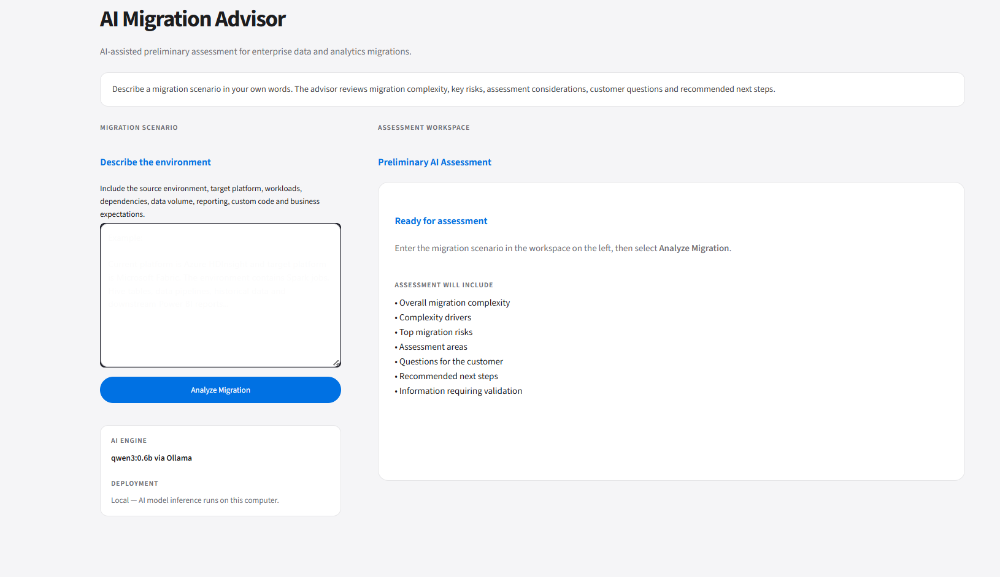
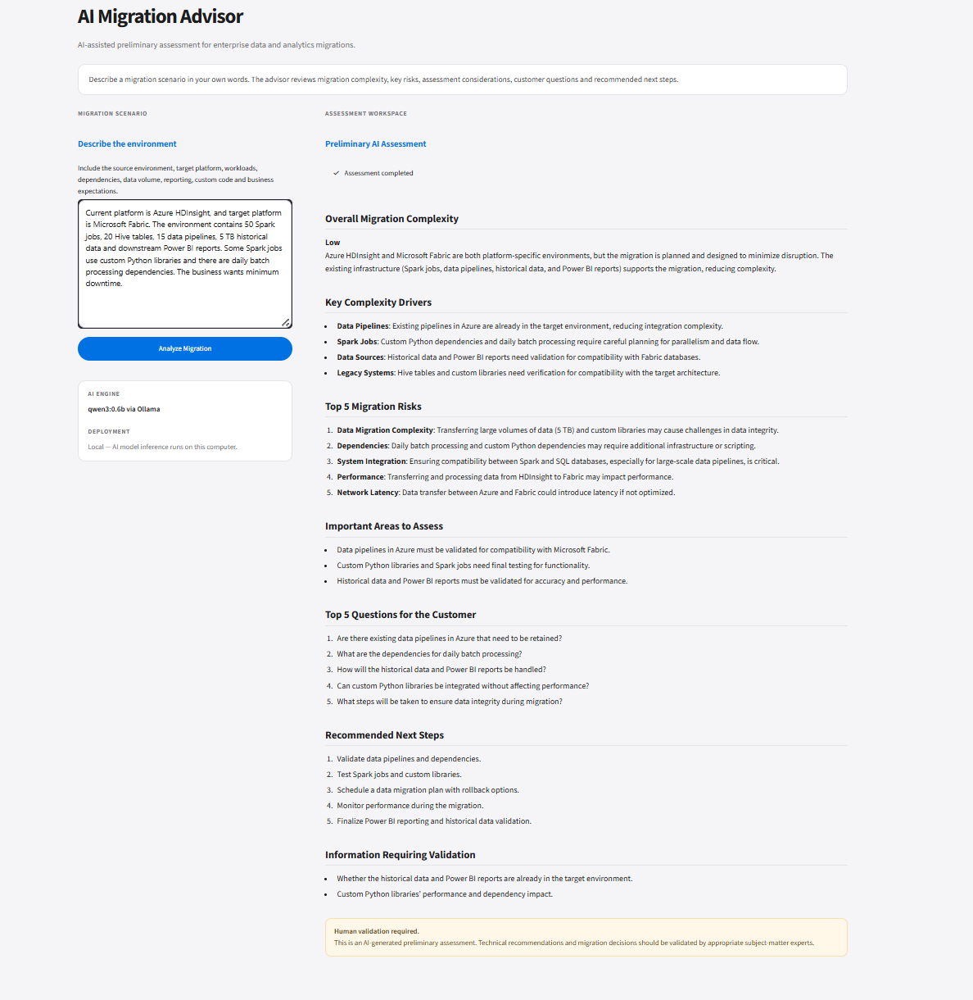

# AI Migration Advisor

> AI-Assisted Preliminary Assessment for Enterprise Data & Analytics Migrations

## Overview

AI Migration Advisor is a domain-aligned GenAI prototype that analyzes enterprise data and analytics migration scenarios provided in natural language.

The application converts a migration scenario into a structured preliminary assessment covering:

- Migration complexity
- Complexity drivers
- Key migration risks
- Important assessment areas
- Questions for the customer
- Recommended next steps
- Information requiring validation

The current prototype uses a locally running open-source LLM and is designed as an AI-assisted assessment tool rather than an autonomous migration decision engine.

---

## Application Preview

## Sample Assessment

---

## Why I Built This

Enterprise migration assessments typically require understanding multiple factors including workloads, dependencies, data volumes, reporting requirements, custom code, operational constraints and target-platform suitability.

The objective of this prototype was to explore how GenAI can assist the early assessment stage while combining:

**Data & Analytics Migration Domain Knowledge + GenAI**

---

## Architecture

User  
↓  
Streamlit UI  
↓  
Python Application  
↓  
Structured Prompt  
↓  
Ollama  
↓  
Qwen LLM  
↓  
Generated Assessment  
↓  
Streamlit UI

### Component Roles

- **Streamlit** — User interface
- **Python** — Application controller
- **Prompt** — Analysis instructions and constraints
- **Ollama** — Local model runtime
- **Qwen** — Language model generating the assessment

---

## Technology Stack

- Python
- Streamlit
- Ollama
- Qwen3
- VS Code

---

## Key Features

### Free-Text Migration Input

Users describe migration scenarios naturally rather than selecting technologies from predefined dropdowns.

### Structured AI Assessment

The application generates consistent assessment sections for complexity, risks, assessment areas, customer questions and next steps.

### Prompt Constraints

The model is instructed not to invent timelines, costs, SLAs, migration utilities or unsupported technical information.

### Local LLM Execution

The prototype runs Qwen locally through Ollama.

### Human Validation

AI-generated recommendations are explicitly presented as preliminary assessments requiring subject-matter expert validation.

---

## Model Experiment

Two local models were evaluated during development.

### qwen3:4b

- Better response quality
- Approximately 4 minutes for a complete response on the development machine
- Too slow for repeated prototype testing

### qwen3:0.6b

- Faster local execution
- Lower hardware requirement
- Selected for the final prototype
- Reduced reasoning capability compared with the larger model

This demonstrated the practical trade-off between:

**Model Quality ↔ Performance ↔ Hardware**

---

## Streaming Experiment

Streaming output was implemented and evaluated.

Although streaming improved perceived responsiveness, it did not reduce total model-generation time and produced a less suitable user experience for this assessment workflow.

The final prototype therefore displays a processing state and presents the complete assessment after generation.

---

## Testing

The application was tested with multiple migration scenarios:

1. Azure HDInsight → Microsoft Fabric
2. Spotfire → Power BI
3. Incomplete migration scenario
4. Azure HDInsight → Power BI

Testing included valid scenarios, incomplete information and an intentionally questionable target architecture.

See [Testing](docs/TESTING.md) for detailed results.

---

## Important Finding

The architectural validation test exposed an important limitation.

When given an HDInsight → Power BI scenario, the smaller LLM generated an assessment instead of reliably questioning the suitability of Power BI as the direct target for HDInsight workloads.

This demonstrates an important GenAI principle:

> Prompt engineering can guide model behaviour, but it cannot guarantee domain-grounded correctness.

---

## Current Limitations

The current prototype:

- Uses an ungrounded general-purpose LLM
- Does not use RAG or an enterprise migration knowledge base
- Cannot guarantee architectural correctness
- Requires human validation
- Is not intended for production migration decisions

See [Limitations](docs/LIMITATIONS.md).

---

## Future Evolution

Potential future enhancements include:

- Grounded migration knowledge
- RAG
- Architecture validation
- Enterprise documentation ingestion
- More capable models
- Cloud/private enterprise LLM integration
- Automated assessment reports
- Agent-based assessment workflows

---

## What This Project Demonstrates

This prototype demonstrates practical understanding of:

- GenAI application architecture
- Python application integration
- Streamlit application development
- Local LLM execution
- Prompt engineering
- Model selection
- AI response testing
- Error handling
- AI limitations and human validation
- Applying AI to an enterprise migration domain

---

## Disclaimer

This project is an educational and portfolio prototype.

AI-generated assessments are preliminary and should not be used as final architecture or migration recommendations without appropriate technical validation.
