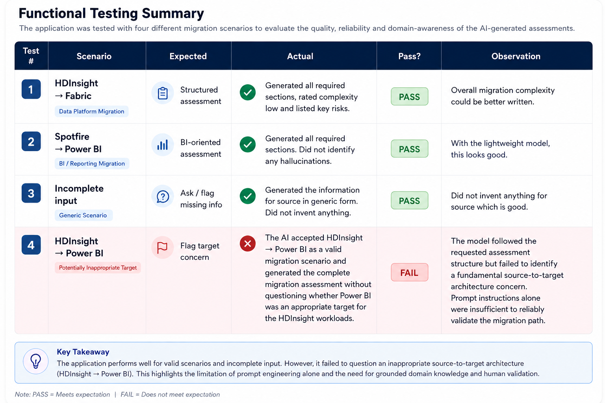

# AI Migration Advisor — Functional Testing

## Testing Objective

The application was tested with multiple migration scenarios to evaluate the quality, reliability, adaptability, and domain awareness of the AI-generated assessments.

The tests included valid migration scenarios, incomplete information, and an intentionally questionable source-to-target migration path.

---

## Functional Testing Summary

---

## Test 1 — HDInsight → Microsoft Fabric

### Purpose

Test a realistic data-platform migration scenario.

### Expected

The application should generate a structured migration assessment covering complexity, risks, assessment areas, customer questions, and recommended next steps.

### Result

**PASS**

Generated all required sections, rated the migration complexity, and identified key migration risks.

### Observation

Overall migration complexity reasoning could be better written.

---

## Test 2 — Spotfire → Power BI

### Purpose

Test whether the application can adapt to a BI/reporting migration scenario without changing the application code.

### Expected

The assessment should focus on BI migration considerations.

### Result

**PASS**

Generated all required assessment sections and produced a relevant BI-oriented assessment.

### Observation

Considering the lightweight local model being used, the generated assessment was reasonable.

---

## Test 3 — Incomplete Input

### Purpose

Test how the application responds when insufficient migration information is supplied.

### Expected

The application should identify or flag missing information rather than inventing details.

### Result

**PASS**

The model kept the source information generic rather than inventing a specific source platform.

### Observation

The model handled missing source information appropriately.

---

## Test 4 — HDInsight → Power BI

### Purpose

Test whether the AI can identify a potentially inappropriate source-to-target architecture.

### Expected

The model should question whether Power BI is an appropriate direct target for HDInsight workloads.

### Result

**FAIL**

The AI accepted HDInsight → Power BI as a valid migration scenario and generated a complete migration assessment without questioning whether Power BI was an appropriate target for the HDInsight workloads.

### Observation

The model followed the requested assessment structure but failed to identify a fundamental source-to-target architecture concern.

Prompt instructions alone were insufficient to reliably validate the migration path.

---

## Key Testing Finding

The application performed reasonably well for valid migration scenarios and incomplete input.

However, Test 4 exposed an important limitation:

> **Prompt engineering can guide an LLM's behaviour, but it cannot guarantee domain-grounded technical correctness.**

This demonstrates why stronger domain grounding, validation mechanisms, and human expert review would be required before such an application could be considered for production migration assessments.
